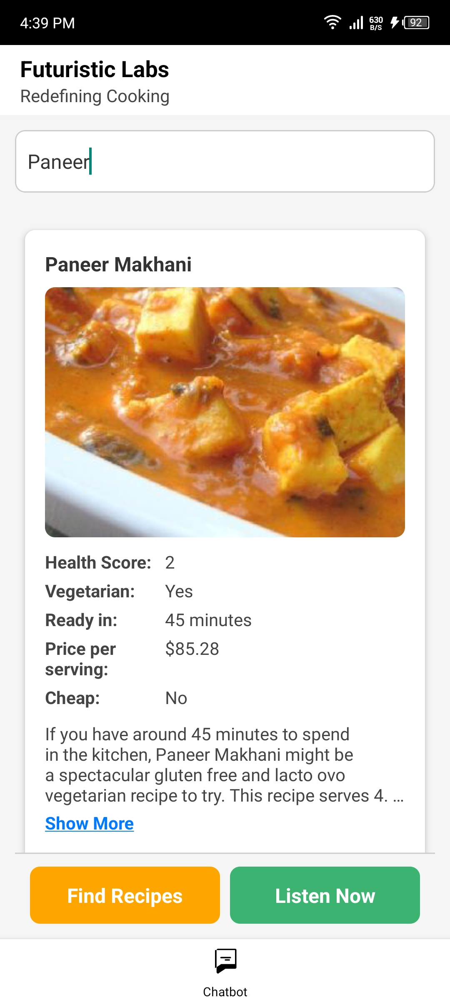
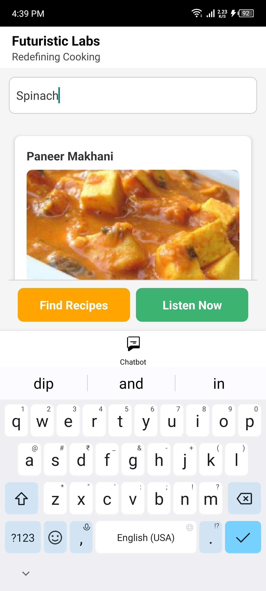
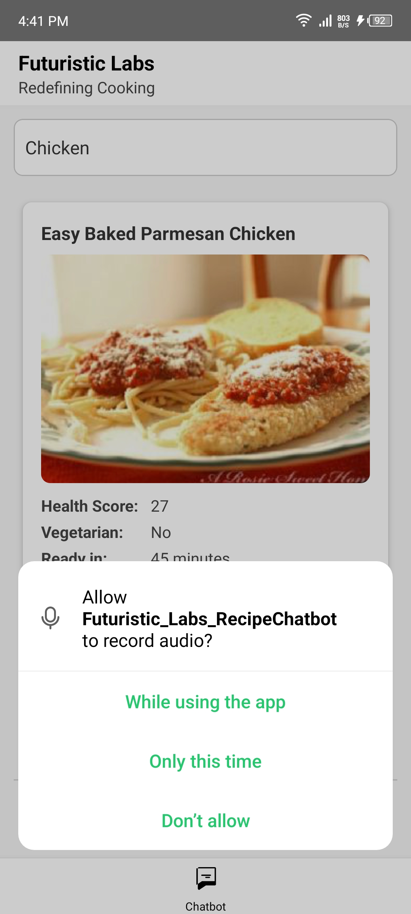
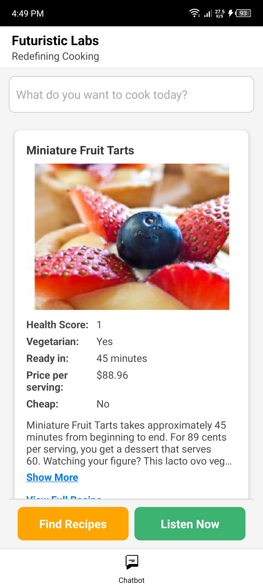

# Recipe Chatbot


Welcome to the Recipe Chatbot project! This application allows users to search for delicious recipes using both text input and voice commands. Whether you are looking for a quick meal or a gourmet dish, our chatbot is here to help you find the perfect recipe.

## Screenshots
Take a look at our app in action:

<p float="left">
  
  
  
  
   
</p>

- **App Overview (`app_overview.jpg`)**: Provides a general overview of the React Native application interface, showcasing various functionalities and components.
  
- **Text Search (`text_search.jpg`)**: Demonstrates the text-based search feature within the app, likely showing a search input field and search results related to recipes.
  
- **Voice Search (`voice_search.jpg`)**: Illustrates the voice recognition feature of the application, allowing users to search for recipes using voice commands.
  
- **Dark Mode (`dark_mode.jpg`)**: Displays the application interface in dark mode, featuring a color scheme optimized for low-light environments.
  
- **Local Storage (`local_storage.jpg`)**: Likely depicts the local storage functionality of the app, indicating how data such as user preferences or favorite recipes are stored locally on the device.

## Overview

The Recipe Chatbot is a React Native application that allows users to search for food recipes using text input or voice recognition. It integrates with the Spoonacular API to fetch recipes based on user queries and displays detailed information including ingredients and cooking instructions.

## Setup

1. **Clone the repository:**
    ```bash
    git clone https://github.com/Saurabhkumar12-byte/Futuristic_Labs_RecipeChatbot.git
    cd RecipeChatbot
    ```

2. **Install dependencies:**
    ```bash
    npm install
    ```

3. **Add your Spoonacular API key:**
    - Register [here](https://spoonacular.com/food-api) and grab your **API key**
    - Create a `.env` file in the root of the project:

    ```
    SPOONACULAR_API_KEY=your_api_key_here
    ```

4. **Run the project:**
    - For Android:
    ```bash
    npx react-native run-android
    ```
    - For iOS:
    ```bash
    npx react-native run-ios
    ```

## Features

- **Text Input and Voice Recognition:** Allows users to query recipes either by typing or using voice commands.
- **Integration with Spoonacular API:** Fetches recipes based on user queries.
- **Recipe Details:** Displays ingredients and cooking instructions for each recipe.
- **Local Storage:** Saves searched recipes for offline access.
- **Dark Mode Support:** Adapts the UI for both light and dark themes.

## Libraries Used

- `react-navigation` for navigation.
- `react-native-voice` for voice recognition.
- `axios` for API requests.
- `async-storage` for local storage.
- `styled-components` for theming.

## Folder Structure

```
RecipeChatbot/
├── android/
├── ios/
├── src/
│ ├── api/
│ │ └── recipeApi.ts # API functions for fetching recipes
│ ├── assets/
│ │ └── images/ # Images and icons
│ ├── components/
│ │ └── RecipeCard.tsx # Component for displaying recipe details
│ ├── hooks/
│ │ └── useVoiceRecognition.ts# Custom hook for voice recognition
│ ├── navigation/
│ │ └── AppNavigator.tsx # Navigation setup using react-navigation
│ ├── screens/
│ │ └── ChatbotScreen.tsx # Chatbot screen with recipe search functionality
│ ├── services/
│ │ ├── localStorage.ts # Functions for saving and loading data locally
│ │ └── voiceService.ts # Integration with voice recognition service
│ ├── styles/
│ │ └── styles.ts # Common styles for the application
│ ├── types/
│ │ └── types.ts # Type definitions used across the app
│ └── utils/
│ └── helpers.ts # Utility functions and helpers
├── .env # Environment variable for API key
├── App.tsx # Main entry point of the application
├── README.md # This readme file
├── package.json
└── tsconfig.json
```


## Usage

1. **Chatbot Screen:**
   - Enter a query in the text input or use voice recognition to search for recipes.
   - Tap "Find Recipes" to fetch and display recipes based on the query.
   - Toggle voice recognition with the "Listen Now" / "Stop Listening" button.

2. **Navigation:**
   - Navigate between screens using the bottom tab bar.
   - Currently, the app only includes the "Chatbot" tab.

## Notes

- Ensure all dependencies are installed before running the application.
- Handle edge cases and errors gracefully, providing meaningful error messages.
- This project is designed as a functional prototype, focusing on core features over UI polish.
